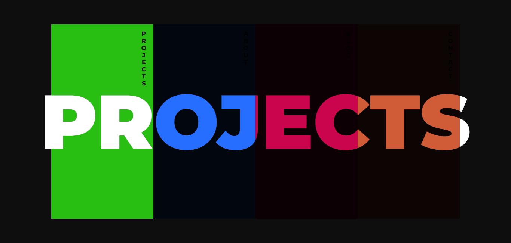

<!-- PROJECT LOGO -->
<br />
<div align="center">

  <h1 align="center">fineliner04</h1>

  <p align="center">
    A colorful, modern navigation page!
    <br />
    <br />
    <a href="https://github.com/ABottleOfSprite/fineliner04/issues">Report Bug</a>
    ·
    <a href="https://github.com/ABottleOfSprite/fineliner04/issues">Request Feature</a>
  </p>
</div>

<!-- ABOUT THE PROJECT -->
## About The Project



'fineliner04' is a modern navigation webpage created with the inspiration drawn from a simple tool - a fineliner of 0.4 mm width. 

#### The Story Behind the Name

The name "fineliner04" originates from the initial planning stages of this project. It all started with a simple sketchpad and a fineliner pen with a 0.4 mm tip. As ideas flowed onto the pages of the sketchpad, the concept for this navigation webpage began to take shape. The precision and finesse of the 0.4 mm fineliner inspired the meticulous design and attention to detail that defines fineliner04.

#### Bringing Ideas to Life

fineliner04 is more than just a navigation webpage; it's a testament to creativity and innovation. From the initial concept sketched out on paper to the final product crafted with code, fineliner04 embodies the journey of transforming ideas into reality. 

#### Explore fineliner04

Navigate through fineliner04 to experience a seamless and intuitive user interface, designed to enhance your browsing experience. Discover the elegance of simplicity and the beauty of precision with fineliner04.


### Built With

Simple tools:

* CSS
* HTML
* JavaScript


<!-- GETTING STARTED -->
## Getting Started

markdown
Copy code
# Getting Started with fineliner04

Welcome to fineliner04, a modern navigation webpage designed to elevate your browsing experience. Follow these simple steps to get started:

## Prerequisites

Before you begin, ensure you have the following:

- Basic knowledge of HTML, CSS, and JavaScript.
- A code editor of your choice (e.g., Visual Studio Code, Sublime Text).

## Setting Up Your Project

1. **Clone the Repository**: Start by cloning the fineliner04 repository to your local machine using Git:

   ```bash
   git clone https://github.com/your-username/fineliner04.git
Navigate to the Project Directory: Change into the project directory:

bash
Copy code
cd fineliner04
Open in Your Code Editor: Open the project folder in your preferred code editor:

bash
Copy code
code .
Customizing Your Website
HTML Structure: Modify the HTML files (index.html, about.html, etc.) to reflect your content and desired webpage structure.

CSS Styling: Customize the appearance of your webpage by editing the CSS files (styles.css, responsive.css).

JavaScript Functionality: Enhance interactivity by modifying the JavaScript files (script.js, lightbox.js, etc.).

Previewing Your Changes
To preview your changes locally:

- Open the HTML file you wish to preview in your web browser.
- Make changes to your code in the editor.
- Refresh the browser to see the updated version of your webpage.


<!-- CONTRIBUTING -->
## Contributing

Contributions are what make the open source community such an amazing place to learn, inspire, and create. Any contributions you make are **greatly appreciated**.

If you have a suggestion that would make this better, please fork the repo and create a pull request. You can also simply open an issue with the tag "enhancement".
Don't forget to give the project a star! Thanks again!

1. Fork the Project
2. Create your Feature Branch (`git checkout -b feature/AmazingFeature`)
3. Commit your Changes (`git commit -m 'Add some AmazingFeature'`)
4. Push to the Branch (`git push origin feature/AmazingFeature`)
5. Open a Pull Request


<!-- LICENSE -->
## License

Distributed under the MIT License. See `LICENSE.md` for more information.>


<!-- CONTACT -->
## Contact

Brandon - [@BrandonPilane](https://twitter.com/brandonpilane)

Project Link: [https://github.com/bABottleOfSprite/fineliner04](https://github.com/ABottleOfSprite/fineliner04)
